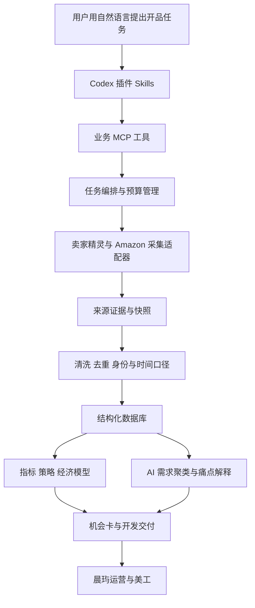

# 晨玙欧洲站 AI 开品插件：工程实现与验收

版本：设计稿 v1.4（精铺版）｜2026-09-18

本文件面向后续开发。固定业务约束：销售站DE/FR/IT/ES；US/DE新品榜作发现来源；目标含税售价€5–20；采购与包装合计≤¥20/销售单位（组合按整套）；至少一个同类中国卖家即可通过该项准入；前期现货与组合，不做定制。主数据路径为**卖家精灵已授权登录页面采集 + Amazon 页面采集**。具体卖家精灵登录后 DOM、网页内部请求地址、当前账号额度尚未实测；本文不会把猜测的接口、选择器或可采字段当作已经验证。先做接入探测，再冻结适配器。

配套：[业务与策略设计](01-欧洲站AI开品-业务与策略设计.md)、[规则配置示例](03-欧洲站AI开品-初始规则配置.json)。配置是设计输入，当前不是已安装可运行插件。

## 1. 总体架构与部署选择

### 推荐第一版：本地插件 + 本地数据服务



职责拆分：

| 模块 | 推荐实现 | 原因 |
|---|---|---|
| 插件入口 | Skills + MCP 配置 | 员工使用自然语言，无须操作采集参数 |
| 业务服务 | Python，数据模型与校验使用类型化 schema | 与现有 Python/Excel 链路衔接 |
| 网页采集 | Playwright 浏览器工作器 | 登录页面、动态表格、分页与页面响应可统一处理 |
| 单机存储 | SQLite + 本地内容寻址快照目录 | 先降低部署和运维成本 |
| 任务队列 | 数据库任务表 + 单调度器 + 租约 | 支持断点、取消、重试和预算 |
| 计算层 | Python 确定性函数 + Decimal 金额 | 数值可复算，避免依赖 AI 算账 |
| AI 层 | 可替换模型适配器，结构化输出 | 用于意图、聚类、评论与方案解释 |
| 输出 | JSON 契约 + Excel/Markdown 报告 | 同时服务现有插件和人工评审 |

多员工稳定使用后再迁移到中心服务与 PostgreSQL。将用户的浏览器授权会话保留在其电脑，中心服务接收任务和已脱敏证据，不能把全员 Cookie 汇总放入一个插件包。需要新增 API 模型调用时独立配置凭据与预算；不默认桌面订阅包含后台服务用量。

插件中的 Skill 负责工作流，MCP 工具负责有边界的业务能力；这与官方插件架构对 Skills、MCP 和可选界面的划分一致。[OpenAI 插件架构](https://developers.openai.com/plugins/concepts/plugins)

## 2. 先选采集模式，不先写死页面接口

### 模式一：专用浏览器会话，作为默认实现

初始化时打开专用浏览器窗口，由用户完成卖家精灵登录。登录后工作器维护这个专用 profile，并在后续任务复用。平时可以隐藏运行，需要登录或人工处理时显示对应页面。

优点：任务可以按计划运行，适配器易回放测试；缺点：需要管理会话寿命，页面变化需维护。

### 模式二：浏览器扩展采集当前页，作为备用实现

员工在已登录浏览器正常访问页面，扩展读取当前页表格和商品信息，交给本地服务。适合网站不稳定支持自动化、或只需要员工浏览时顺便积累数据的情况。扩展只申请明确站点权限，不能泛读所有网页。

优点：会话自然、可见；缺点：自动调度与完整分页能力弱。两种模式都输出相同 Observation 契约，业务层无需重写。

### 模式三：文件导入作为恢复通道

用户选择从网站导出的文件时，导入适配器保留原文件哈希、表名、行列、导出时间与过滤条件，按同一规则入库。它是直接采集不可用时的补充，不是日常必须先人工整理表格。

### 会话边界

Playwright 支持复用浏览器认证状态，但状态文件可能包含敏感 Cookie，不能进入代码库、报告或模型上下文。会话存操作系统账户保护的本地目录，使用受限文件权限；不要复制用户整个日常浏览器资料目录。[Playwright 认证文档](https://playwright.dev/python/docs/auth)

页面访问与账号授权、服务条款及站点限制相匹配；遇到验证码或访问拒绝，保存检查点并请求人工接续，不使用绕过措施。这里只设计正常授权页面的采集。

## 3. 接入探测：第一项开发任务

输出一个 `source-capabilities.json`，按“来源 × 账号 × 站点 × 页面类型”描述能力：

```json
{
  "schema_version": "1.0",
  "source": "sellersprite_web",
  "account_ref": "local-account-1",
  "marketplace": "DE",
  "page_kind": "market_list",
  "status": "unverified",
  "available_fields": [],
  "history_start": null,
  "page_size": null,
  "visible_result_cap": null,
  "capture_modes": [],
  "tested_at": null,
  "adapter_version": null
}
```

探测步骤：

1. 验证登录成功、账号标识和所选站点，不保存密码。
2. 分别打开选市场、选产品、商品详情、关键词、评论等当前账号可见模块。
3. 人工核对每种页面的 2—3 个样本：筛选条件、分页、时间窗、父子体和单位。
4. 确认可采的是完整表格、可视区行、摘要还是按需展开详情。
5. 检查每次页面操作产生的正常网络响应，识别是否有对应的结构化业务数据。
6. 确定允许保存的必要字段、脱敏规则及返回上限。
7. 采集下一页、改变站点、改变月份，验证不会把旧页面数据归入新条件。
8. 冻结已验证的页面描述和字段映射，未验证能力维持 unknown。

卖家精灵公开“选市场”页可看到市场、新品、卖家所属地等筛选概念；登录后具体可用能力仍依账号实测。[选市场页面](https://www.sellersprite.com/cn/v2/market-research)

官方 API 文档说明部分查询有 TOP 2000 限制，但不能直接把它视为网页版当前账号上限。网页必须记录自己的可见总数、可翻页数、截断标记；在页面允许范围内细分类目、价格或日期，并记录采样边界。[官方接口限制说明](https://open.sellersprite.com/api)

## 4. 卖家精灵采集适配器

### 4.1 提取优先顺序

1. **正常页面操作已返回的结构化数据**：监听当前会话访问页面时收到的响应，核实与页面可见数据一致后提取。只处理已验证的业务响应类型，不记录所有网络流量。
2. **DOM 表格与详情**：按列标题、区域标签、商品标识定位，不依赖“第 7 个 td”这类位置猜测。
3. **页面允许的下载结果**：作为独立来源记录。
4. **截图/OCR**：仅作必要的辅助证据，低置信数字不直接进入利润与评分。

Playwright 有页面网络监听能力，可捕获 XHR/fetch 等响应；这并不意味着可以假定卖家精灵存在某个稳定公共接口。[Playwright 网络文档](https://playwright.dev/python/docs/network)

网页内部请求是浏览器适配细节，不直接作为长期业务 API 暴露。不编造签名、不调用超出当前账号可见权限的接口。若响应类型变化，切换到已验证 DOM 解析或停止该模块。

### 4.2 页面对象

以下为模块设计名，不是当前网站的真实 URL 或 CSS 选择器：

```text
SellerSpriteSession
MarketListPage
MarketDetailPage
ProductResearchPage
ProductDetailPage
KeywordResearchPage
KeywordReverseLookupPage
ReviewPage
```

公共方法：`open()`、`assert_identity()`、`apply_filters()`、`read_filter_state()`、`wait_for_result_change()`、`extract()`、`next_page()`、`capture_evidence()`。

每个页面对象配置：实际入口、语义定位器、必要锚点、字段映射、等待条件、正常空态、权限不足态、登录失效态、验证码态、允许的响应 matcher、适配器版本。

优先使用角色、标签和稳定的页面标识；复杂定位集中在适配器中维护。官方定位器文档支持按 role/label/text 等语义定位。[Playwright 定位器](https://playwright.dev/python/docs/locators)

### 4.3 一次列表采集的完整流程

```text
取得账号锁与任务租约
→ 验证会话与页面类型
→ 切换站点、时间窗、类目、排序与过滤条件
→ 读取界面当前条件，确认和任务一致
→ 等待目标业务响应/结果区域更新
→ 验证页码、首行标识及结果指纹已变化
→ 提取当前页
→ 校验字段、单位与实体
→ 保存脱敏证据与哈希
→ 原子写入观察记录、页状态与检查点
→ 预算允许且有下一页时继续
```

不能只 `sleep(3)` 就假定页面已更新。虚拟滚动表格要按 ASIN 集合去重并检查稳定结束条件；只读取首屏时必须标记 partial。

对页码变化但返回相同数据、排序条件未生效、列表总数突变、历史窗口未切换等情况触发一致性错误。完整结果标记 complete 的依据是“计划范围确实读完”，不是“解析出了一行”。

### 4.4 单账号并发与限速

初始使用单账号一个活动采集导航任务，批间隔可从 3—8 秒作为性能试验参数，最终依据页面响应、用户授权额度和访问反馈配置；它不是网站允许速率的声明。CPU 清洗和分析可以与浏览器等待分开执行。

每个来源具备令牌桶/节流配置、超时、最大页数、连续错误熔断和日预算。不要用增加账号或代理的方式绕过拒绝。

## 5. Amazon 采集适配器

### 搜索页

每次保存：站点、查询原词、语言、配送地区/邮编、Prime/登录状态是否已知、排序、页码、观察时间、页面块类型、自然排名、广告标签、ASIN、展示价格、配送信息。

自然位与广告位分别编号；推荐模块、编辑推荐与普通自然商品区分。查询返回的“结果总数”只作页面显示值，不用于精确计算竞争强度。

### 商品页

保存 ASIN、最终页面 ASIN、父体关系证据、选中变体、标题、五点、描述/A+、图片角色、品牌、商品/包装尺寸、声明材质、套装件数、当前报价卖家、配送方式、可见评分与购买量提示。

价格拆分 `regular / buy_box / prime / coupon / shipping / effective_scenario`。Prime 或需勾选的优惠条件保留，不能默认所有顾客都能拿到最低价格。列表价与详情价冲突时分别保存，不静默覆盖。

`100+ bought in past month` 保存为下界型观察，不转换为精确 100；缺少上界时保持 null。缺货、无报价、未配送至设定地区、商品不存在、被拦截是不同状态。

### 评论页

记录评论 ID（可见时）、所在来源、评论原站点（可知时）、语言、日期、星级、变体和正文。个人姓名、头像、主页等不进入分析库；有去重需要时使用本地匿名标识。

建立产品组与评论集合的多对多关系，避免同一条共享评论在不同 ASIN/站点重复计数。无稳定 ID 时，使用规范化正文+日期+星级+变体等生成候选重复指纹；不确定的重复关系记录置信度，不把相似短评论强制合并。

评论采样优先近期、不同商品组和星级分层；将“星级优先采样”和“近期采样”分别记录。若页面只能提供有限评论，报告其覆盖限制，不承诺抓全。

### 本地化和身份校验

商品页必须确认站点、实际商品身份和选中变体；重定向到其他商品不能作为原 ASIN 成功结果。图片不能仅凭附近文本归到该商品；共享评论也不能当某一尺寸的实际销量证据。

## 6. 数据模型与字段契约

### 6.1 建议实体

| 实体/表 | 主键或自然键 | 主要字段 |
|---|---|---|
| workspace / account | UUID | 所属用户、来源、授权引用；不存明文凭据 |
| market_profile | market+version | 站点、域名、语言、币种、地区与规则引用 |
| crawl_run | UUID | 任务输入、计划范围、预算、状态、起止时间 |
| crawl_job | UUID | 类型、父任务、参数哈希、租约、重试、检查点 |
| source_snapshot | hash | 脱敏原始数据、HTML/截图路径、来源与采集上下文 |
| product | market+ASIN | 本站实体，不将不同站点直接合并 |
| product_relation | UUID | parent/child、等价商品、证据、有效期、置信度 |
| brand / seller | 来源标识 | 名称、所属地声明、关联关系证据 |
| observation | UUID | 实体、字段、值、单位、层级、时间窗、来源 |
| search_snapshot / hit | 查询上下文+时间+位置 | 查询、广告/自然、ASIN、排名与邮编 |
| keyword / keyword_observation | market+locale+规范词 | 原词、时间窗、估计搜索量、其他指标 |
| review / review_product_link | 源ID或指纹 | 脱敏原文、星级、日期、归属关系 |
| need_cluster / membership | UUID | 购买意图、语言别名、归属与排除依据 |
| opportunity / concept | UUID+revision | 站点、需求簇、产品方案、策略命中 |
| supplier_quote | UUID | 款式、报价口径、币种、MOQ、交期、有效期 |
| cost_scenario / fee_rule | UUID+version | 假设、费用、时效、履约/税务口径 |
| metric_run / score | UUID | 输入证据、公式版本、结果与缺失权重 |
| gate_assessment / decision | UUID | 适用性、通过状态、人工修改理由 |
| artifact / handoff | UUID | 交付路径、契约版本、来源版本、确认记录 |

数据库唯一约束与外键必须覆盖以上关系；金额用 Decimal/定点整数，币种和精度独立存储。数据时间统一 UTC，同时保留来源时区和原始显示值。

### 6.2 Observation：最重要的契约

将“我抓到了这个数字”和“这个数字是真实销量”拆开：

```json
{
  "schema_version": "1.0",
  "observation_id": "obs-demo-001",
  "entity": {"marketplace": "DE", "asin": "SYNTHETIC_ONLY"},
  "field": "purchased_badge_units",
  "raw_value": "100+",
  "value": null,
  "value_type": "lower_bound",
  "lower_bound": 100,
  "upper_bound": null,
  "unit": "units",
  "currency": null,
  "scope": "unknown",
  "period": {"kind": "rolling_30d", "start": null, "end": null},
  "observed_at": "2026-09-18T08:00:00Z",
  "source_updated_at": null,
  "fact_class": "source_claim",
  "source": {
    "provider": "amazon_web",
    "page_kind": "product_detail",
    "url": null,
    "snapshot_id": "synthetic-snapshot",
    "field_locator": "purchase_badge",
    "adapter_version": "demo"
  },
  "status": "ok",
  "missing_reason": null,
  "quality_flags": ["synthetic_example", "sales_scope_unconfirmed"],
  "evidence_ids": ["synthetic-snapshot"]
}
```

此例使用显式非 ASIN 的合成标识，仅用于说明；真实采集入口必须验证 ASIN 格式并拒绝示例实体。

`fact_class`：`source_claim`（页面声明）、`third_party_estimate`、`own_actual`、`supplier_quote`、`user_confirmed`、`model_inference`、`scenario_assumption`、`computed`。

`value_type`：`exact_displayed`、`range`、`lower_bound`、`text`、`missing`。exact_displayed 只说明来源明确显示该值，不等于它反映的现实变量精确可信。

`scope`：`parent`、`child`、`product_group`、`keyword`、`sample_market`、`unknown`。

`status`：`ok / missing / conflict / stale / invalid / not_applicable`。缺失原因进一步区分页面未呈现、未展开、无权限、来源无记录、解析失败、被拦截和不适用。

### 6.3 销量和时间窗的强制规则

每个销量字段必须有来源、层级和周期。卖家精灵公开文档将父体月销量与子体近 30 日销量分开；网页实测后创建独立映射，不能把两者统一命名为 sales 后混算。[卖家精灵销量字段](https://open.sellersprite.com/api/2)

“自然月”与“滚动 30 日”不能直接同比；来源刷新时间与采集时间不同，刷新滞后需标记。没有足够历史时不要编造趋势。

月父体销量多次出现在子体行中，只保留一次；不同源同一指标保留多观察，按明确规则选择计算输入，不能相加。父体关系变化保留有效期，不能用今天关系回写所有历史。

### 6.4 跨站商品匹配

匹配等级：同 ASIN 高置信候选、GTIN/型号+规格匹配、品牌+图像+尺寸相似候选、AI 语义候选。只有证据足够的等价商品进入同规格价格比较；同 ASIN 也检查页面规格与包装变化。

不同站点销量独立存储；全球产品组只用于关联，不汇总评论数成独立消费者总量。

## 7. 清洗与质量控制

规则次序：原始保存 → 字符/单位解析 → 实体身份 → 周期/层级 → 关系去重 → 指标输入资格。

1. 本地数字：`1.299,99 €` 与 `1,299.99` 按来源 locale 解析；含税状态未知不得默认为 net。
2. 单位：cm/mm/in、g/kg/lb 转统一单位，同时保留原值；包装尺寸和产品尺寸分列。
3. 件数：套装数量、采购数量、变体数量分开。
4. 特殊值：`-1`、`--`、空串如何解释由字段映射决定，不能全局替换为 0。
5. 异常值：价格、尺寸跳变先标记，必要时复采，不直接删除市场真实变化。
6. 身份冲突：站点、ASIN、变体或报价卖家不一致时隔离，禁止继续算利润。
7. 跨来源冲突：显示两条观察及其时间上下文，按字段级选择策略决定采用值。
8. 语义：法语重音、德语变音和本地词形保留；品牌词识别与通用词分开。
9. 采样：保存过滤条件、排序、采集范围和截断；不能把筛掉低销量商品后的样本解释为全市场。
10. 数据脱敏：Cookie、Authorization、账号个人信息及评论人身份从快照、日志和模型输入移除。

采样覆盖率未知时显示 unknown；只有知道抽样框分母时才计算覆盖率。来源未提供某字段与解析器坏了必须分别计数。

## 8. 任务系统与恢复机制

### 8.1 状态机

任务状态：

```text
queued → running → succeeded / partial / failed / cancelled
            ├─ waiting_login
            ├─ waiting_user
            ├─ retry_wait
            └─ paused_budget
```

恢复需验证 session、检查点和适配器版本；不从第一页无条件重跑。partial 任务保留成功页及失败页清单。

业务机会阶段使用另一状态机，避免“采集成功”自动变成“值得采购”。

### 8.2 幂等与断点

`logical_job_key = hash(账号权限范围, 来源, 页面类型, 站点, 规范化参数, 计划快照周期, adapter_version)`。

相同逻辑任务只允许一个活动实例；同一周期重试复用已成功页，新的观察周期可以创建新快照。页检查点包括过滤条件回读、页号/游标、末尾商品标识、内容哈希和完成行数。

数据库写入与页完成标记在同一事务；快照先落临时文件，校验哈希后原子改名，再提交引用。启动恢复时清理孤立临时文件，核查悬空引用。单机 SQLite 采用一个写入通道，避免多工作器争写。

### 8.3 错误分类

| 错误 | 处理 | 是否继续其他任务 |
|---|---|---|
| SESSION_EXPIRED | 保存检查点，提示对应账号重新登录 | 可继续无依赖来源 |
| CAPTCHA_REQUIRED | waiting_user，展示原页面 | 可继续其他独立工作 |
| ACCESS_DENIED | 停止该来源/模块，保留证据 | 是 |
| RATE_LIMITED | 尊重等待指示，退避；连续出现熔断 | 其他来源可继续 |
| TRANSIENT_NETWORK | 有上限的退避重试，例如最多 2 次 | 是 |
| SELECTOR_DRIFT | 解析器熔断，保存页面供维护 | 其他页面类型可继续 |
| IDENTITY_MISMATCH | 隔离数据，人工/规则复核 | 是 |
| NO_RESULTS_CONFIRMED | 成功空结果，带查询条件证据 | 是 |
| PARTIAL_VISIBLE_DATA | 保存有效数据，披露截断 | 是 |
| QUOTA_EXHAUSTED | paused_budget 或 waiting_user | 继续已采数据分析 |

HTTP 200 的验证码页不能解析成无商品。账号失效不能不断自动重新登录。错误消息只显示当前任务需要的动作。

### 8.4 预算与自主补采

每个 run 配置导航次数、最多商品、评论页、耗时、存储和模型用量。任务开始时给出计划范围；预算耗尽自动生成当前结果与未覆盖范围。

补采优先级启发式：

`priority = 决策重要度 × 当前不确定度 × 可获得证据程度 / 预计采集成本`。

这不是统计概率模型。优先核实可能改变淘汰/推进结论的字段：身份、包装尺寸、价格、关键痛点，而不是无限补低价值评论。强制项缺失优先于小幅排序优化。

## 9. 计算与 AI 分工

### 程序负责

去重、货币与单位、时间对齐、集中度、趋势特征、费用与税额、敏感性分析、分数区间、预算、检查点、证据引用校验。

### AI 负责

自然语言任务转研究范围、本地需求聚类、评论主题、候选相关性、可执行差异化假设、总结反面证据和下一步验证。

### AI 输入/输出约束

输入为精简的结构化证据，原页面文字标记为不可信内容，不自动获得工具权限。禁止模型执行网页里的指令；域名和工具参数由服务层校验，网页中的任意 URL 不自动访问。

输出采用 schema，并强制引用存在的 evidence_id。建议评论主题输出：

```json
{
  "topic_id": "adjustment_fit",
  "need_cluster_id": "cluster-demo",
  "language": "de",
  "problem": "演示：某现货尺寸不适配特定使用空间",
  "evidence_ids": ["review-demo-1", "review-demo-2"],
  "distinct_product_groups": 2,
  "sample_denominator": 40,
  "sampling_note": "演示：分层采样，不能解释为全体缺陷率",
  "improvement_hypothesis": "寻找已有合适尺寸的现货或匹配现成配件",
  "supplier_questions": ["是否有现成匹配规格，单价和包装成本是多少"],
  "claim_status": "hypothesis",
  "requires_validation": true
}
```

主题出现次数与分母由代码从标签结果重新计算，不接受模型直接报数。schema 失败最多作一次修复，再降级为待人工检查；不让模型补造没有的引用。固定 prompt_version、model_identifier、输入哈希，便于重算和比较。

原始评论/图片仅在任务确有需要时进入模型，采用最小必要片段。对供应商机密报价提供本地计算模式，语言模型只接收计算后的范围或结论。

## 10. MCP 工具与服务接口

原则：暴露业务工具，不暴露任意浏览器脚本、任意 SQL 或命令执行。

| 工具 | 关键输入 | 返回与行为 |
|---|---|---|
| `kaipin_source_status` | source、account_ref | 会话、可用模块、未验证能力 |
| `kaipin_prepare_session` | source、account_ref | 打开正常登录窗口，返回会话准备状态 |
| `kaipin_plan` | 用户目标、站点、约束、预算 | 研究计划、假设、预计采集范围；不自动执行无界扫描 |
| `kaipin_start` | plan_id、配置版本、idempotency_key | run_id，立即返回 |
| `kaipin_status` | run_id、after_cursor | 新进度、成功/失败/待处理计数 |
| `kaipin_resume` | run_id | 验证条件后恢复断点 |
| `kaipin_cancel` | run_id | 停止新增任务，保留已有成果 |
| `kaipin_opportunities` | run_id、筛选、分页 | 机会摘要、分数区间、质量、阶段 |
| `kaipin_explain` | opportunity_id、revision | 支持/反对证据、假设和计算来源 |
| `kaipin_enrich` | opportunity_ids、requested_evidence、budget | 针对缺口补采的子任务 |
| `kaipin_calculate` | concept_id、成本/情景输入 | 确定性贡献利润、采购上限、敏感性 |
| `kaipin_set_decision` | opportunity_id、decision、reason | 记录明确用户决策，不自动下单 |
| `kaipin_export` | run_id、格式、handoff_target | 输出清单、契约版本及绝对路径 |

所有写工具检查工作区归属、路径边界和允许枚举。相同幂等键配不同参数应返回冲突，不应复用错误任务。

公共响应：

```json
{
  "schema_version": "1.0",
  "request_id": "req-demo",
  "run_id": "run-demo",
  "status": "partial",
  "data": {},
  "warnings": [{"code": "HISTORY_INCOMPLETE", "message": "部分候选缺少同比历史"}],
  "evidence_ids": [],
  "next_cursor": null
}
```

内部适配器接口建议：

```python
class ResearchProvider:
    async def capabilities(self, context): ...
    async def discover_markets(self, query, checkpoint): ...
    async def discover_products(self, query, checkpoint): ...
    async def product_detail(self, market, asin): ...
    async def product_history(self, market, asin, period): ...
    async def keyword_research(self, query, checkpoint): ...
    async def keyword_reverse_lookup(self, market, asin): ...
    async def search_results(self, market, query, location): ...
    async def reviews(self, market, asin, sampling, checkpoint): ...
```

方法返回统一的 observation 批次、source_snapshot 引用、覆盖和分页状态。某来源不支持的能力返回 not_supported，不用空列表冒充成功无数据。网页适配器、文件适配器、未来可选 API 适配器均遵守这一接口。

## 11. 插件目录与现有插件兼容

建议开发源目录结构；不要在安装缓存目录直接开发，也不要将真实数据混入插件：

```text
chenyu-kaifa/
├─ .codex-plugin/plugin.json
├─ .mcp.json
├─ skills/
│  ├─ chenyu-kaifa/SKILL.md           # 总入口与完整闭环
│  ├─ chenyu-jihui/SKILL.md           # 机会发现和补证据
│  └─ chenyu-kaifa-pingshen/SKILL.md # 报价/方案评审与交接
├─ references/
│  ├─ strategies.md
│  ├─ source-semantics.md
│  └─ handoff-contract.md
├─ service/
│  ├─ mcp_server.py
│  ├─ jobs/
│  ├─ providers/sellersprite_web/
│  ├─ providers/amazon_web/
│  ├─ providers/import_file/
│  ├─ normalize/
│  ├─ metrics/
│  ├─ economics/
│  ├─ strategies/
│  ├─ ai/
│  └─ exports/
├─ schemas/
├─ config/
├─ migrations/
└─ tests/fixtures/                    # 脱敏或合成样本
```

Skill 规定何时调用工具、如何处理未知、何时交付；业务算法和爬虫放在可测试服务中。当前不需要为每条策略建立一个独立 Agent，也不依赖多 Agent 才能运行。

与现有 `chenyu-yunying` 0.8.3 的兼容建议：

1. 保留 `competitor-research.json` 顶层的 research_status、competitors、keyword_evidence、visual_evidence、exclusions。
2. 各 competitor 保留站点、ASIN、product_group、sources、文本/图片字段、读取时间、status 和字段状态。
3. 新增销量与经济模型放在独立文件，通过 competitor_id 关联，避免把旧下游未知字段混成自有事实。
4. 建立版本化转换器和兼容检查：缺字段明确缺失；不能为了满足 schema 捏造五点、图片或规格。
5. 运营插件请求补采时，先检查缓存、证据有效期和覆盖，优先复用。
6. `development-brief.json` 自有事实每项携带 confirmed/unknown/conflict；研究推测留在 hypotheses。

开品输入可以仍然接收用户的开发 Excel，但同一个文档只解析一次，原始素材和业务数据保留在任务目录。

## 12. 产品界面和交付体验

员工界面建议只展示五个主要区域：

1. **任务范围**：站点、可用预算、单品或现货组合偏好、偏好的测试周期；可留空并显示假设。
2. **采集进度**：已完成/未完成的市场与商品，当前等待原因，继续登录入口。
3. **机会列表**：需求、首发站、进入证据、分数范围、数据质量、采购成本上限、阶段。
4. **机会详情**：支持证据、反面证据、现货与组合方案、利润情景、下一步动作。
5. **开发交付**：导出、补充报价、样品结果、交给运营。

“为什么推荐”和“什么信息会让结论改变”应直接可见。模型、选择器、数据库等实现细节放维护界面，不进入员工正常业务流程。

机会总览默认按当前阶段可执行性排序，再按分数区间与证据质量；避免未知成本候选凭虚高评分排在可验证方案前面。

## 13. 更新、缓存与来源版本

建议初始研究刷新窗口：报价/促销/可售状态 1 天、短期观察目标更短；销量/关键词摘要 7 天并检查源刷新时间；月度历史在数据更新后刷新；详情结构与图片 30 天或检测到变体变化；费用和合规在关键决策前核查。

这些是缓存政策，不是来源更新频率。采集再频繁也不能提高月度模型的真实精度。

每个机会引用固定快照集，刷新创建新 revision，保留旧判断。计算依赖图只重算受影响的指标，不为修一个价格重做全部评论分析。

定期任务可在后续产品中提供“每周发现、每日观察重点候选”等可配置能力；本次设计没有创建实际自动化。监控只在判断发生重要变化、任务失败或需要用户操作时通知。

## 14. 开发拆分与里程碑

工期仅是排期起点：一位熟悉浏览器采集的工程师与一位能做数据标注/验收的运营配合，接入顺利时可按 4—6 周规划 MVP；实际取决于页面稳定性、账号能力和验收结果。

| 编号 | 工作包 | 依赖 | 验收产物 |
|---|---|---|---|
| K01 | 账号与页面能力探测 | 无 | capability 矩阵、脱敏样本、已知限制 |
| K02 | 字段字典与 Observation schema | K01 | 口径表、父子体/币种/时间规则 |
| K03 | 任务队列、预算、快照、检查点 | K02 | 可中断恢复的任务运行器 |
| K04 | 卖家精灵列表/详情采集 | K01/K03 | 选市场、选产品、趋势读取 |
| K05 | Amazon US/DE新品榜、搜索/详情 | K03 | 榜单身份、本地搜索与选中变体证据 |
| K06 | 统一清洗与商品组关系 | K02/K04/K05 | 无重复计量的候选库 |
| K07 | 策略注册与单卖家准入 | K06 | A/B/C/D/E/F/H/I/J可调度；同类、新品、FBM、历史旺季候选；一个CN即pass |
| K08 | 共用验证与方案生成 | K05/K06 | 本地词/评论辅助、单品/多件装/互补组合、组合BOM |
| K09 | 单品/整套成本与利润 | K02/K08 | 采购包装≤¥20、售价€5–20、三情景 |
| K10 | 机会评分和门槛流程 | K07/K08/K09 | 评分区间、质量分、阶段 |
| K11 | MCP + Skills + 报告 | K03/K10 | 自然语言端到端操作 |
| K12 | 运营插件交接兼容 | K11 | 开发资料和统一竞品研究包 |
| K13 | 两榜来源和四销售站验收 | K04—K12 | US/DE发现与DE/FR/IT/ES费用/语言fixtures |
| K14 | 回放、异常、影子运行 | 全部 | 发布验收记录和成本统计 |

建议顺序：先用一个站点的两个差异明显类目把链路做通，随后覆盖四站；数据模型一开始支持四站。前台为统一工作台和可选策略池；按任务展示计划、策略命中及共同验证，不为每个策略复制一套操作流程。

## 15. 必须覆盖的测试与上线门槛

测试重点放在会改变业务判断的错误，避免只验证函数存在。

| 用例 | 期望结果 |
|---|---|
| 同一父体 8 个子体各出现父销量 1000 | 商品组需求计 1000，不能计 8000 |
| 父体销量 1000 + 两个子体销量 200/300 | 不直接相加成 1500；保留层级与覆盖 |
| 月销量与近30日销量混入同趋势 | 拒绝直接对比，显示口径不一致 |
| 同 ASIN 四站页面 | 四个本站实体，明确跨站关联 |
| 共享评论在三个子体出现 | 评论分析按唯一证据计一次 |
| 法语价格 1.299,99 与英文价格 1,299.99 | 按各自 locale 解析为相同数值 |
| 购买量“100+” | 下界 100，不进入精确销量加总 |
| HTTP 200 返回登录或验证码 | waiting_login/waiting_user，不标无结果 |
| 下一页按钮未生效或虚拟表格重复 | 识别指纹重复，停止错误翻页 |
| 价格采完、写库前程序退出 | 恢复后不重复入账，不丢失已提交页 |
| 商品跳转至另一个 ASIN | identity_mismatch，不能写到原商品 |
| 修改包装尺寸跨费用档位 | 自动重新计算对应费用和利润 |
| 已含优惠的成交价再输入 Coupon | 不重复扣折扣，只计独立费用 |
| CPC 翻倍、CVR 减半 | 每广告订单成本变为原来的 4 倍 |
| 成本或强制项未知 | 不能进入可采购状态 |
| 缺失指标 | 分数区间扩大，不重分权重制造高分 |
| 非法 evidence_id 或网页提示“忽略规则” | 引用校验失败；不执行页面指令 |
| 账号 Cookie 出现在网络响应日志 | 被脱敏/阻断，不能出现在交付包 |
| 新品发现来源传入销售评估 | 根据任务角色校验，销售评估使用DE/FR/IT/ES允许列表 |
| 相同幂等键重复触发任务 | 返回已有任务，不产生第二次采集 |
| 费用规则更新后回放旧报告 | 旧报告固定旧版本，新报告使用新版本 |

初始验收指标建议：

- 每站至少 10 个跨规格/语言的人工核对样本，另设异常 fixture；抽样范围记录清楚。
- 人工标注集中关键字段准确率目标 ≥98%，身份、币种、销量层级及金额计算的发布用例必须全部通过。
- 所有用于推荐和计算的数值可追溯率 100%；真实可得字段覆盖率单独报告，不把无法访问页面算解析正确。
- 核心公式误差不超过约定货币最小精度；中间步骤不提前过度四舍五入。
- 中断恢复、取消、验证码、登录失效、页面改版和预算耗尽能稳定落入正确状态。
- 用固定历史快照重算结果一致；模型分析的非确定性不能改变已冻结的原始数据和财务计算。
- 运行一次受控的完整任务，交付至少一个能明确进入“询价/现货验样/淘汰/补证据”之一的机会案例；不要求为了验收硬凑可开产品。

## 16. 成本测算与上线后的校准

每次任务记录：页面导航数、重试数、来源等待时间、浏览器运行时间、结构化记录数、去重比例、模型输入输出量、保存空间、人工介入次数。

成本模型：`任务成本 = 浏览器/服务运行成本 + 模型成本 + 数据访问成本 + 人工维护成本`。直接采网页减少某些接口付费依赖，但并非零维护成本。

初始性能试验可以设置最多 300 次导航、120 个详情商品、80 个评论页等上限；这些不是期望全部跑满的目标。先用 20—30 次导航估计模块耗时与有效率，再决定任务规模。

报告每个有效机会平均耗时和成本；低价值模块自动减少采样，不仅追求抓取数量。

上线后的结果闭环：机会 revision → 询价 → 样品 → 是否推出 → 实际售价/广告/退货/贡献 → 30/60/90 天复盘。未推出原因也要保存。通过时间切分和历史回放调整规则，禁止把后来的销量或评论泄漏到当时的评分输入。

## 17. 指标配方与规则执行顺序

### 标准化函数

每个指标的配置至少包含：`metric_id / input_fields / eligible_scopes / required_period / aggregation / direction / normalizer / anchors / min_sample_size / missing_policy / evidence_requirements / version`。

初期建议统一实现三种函数，分数均为 0—100：

```text
benefit(x, L, H) = 100 × clamp((x-L)/(H-L), 0, 1)
cost(x, L, H) = 100 - benefit(x, L, H)
target_band(x, L, A, B, H):
    x <= L 或 x >= H → 0
    L < x < A → 100 × (x-L)/(A-L)
    A <= x <= B → 100
    B < x < H → 100 × (H-x)/(H-B)
```

L/H 可取固定参考样本的 P5/P95；样本重尾明显时先做 log1p，再冻结锚点。参考组建议至少 30 个独立商品组，不足时使用运营明确设置的业务锚点；仍无锚点则指标未知。H=L、样本缺失或单位不同必须返回错误/未知，不能除零或默认满分。

需求规模适配使用 target_band，竞争集中度通常使用 cost，经济贡献通常使用 benefit。具体 A/B/L/H 依类目、资源与历史验证设定，不建议在没有真实样本时给所有类目统一设值。

### 中国卖家准入规则

`confirmed_similar_cn_seller_count >= 1 → pass`。数量2、3或更多只作描述，不再分档打分，不要求持续商品组数量。未找到时记录not_found_in_sample；来源/身份无法核实时unknown，不能凭名称推断。

中国卖家证据允许来自US或欧洲研究站点，不再要求每个目标站都存在中国卖家。目标站需求另行判断。普通单品不因没有组合或定制创新而扣分。

需求、竞争、现货方案、单位经济、执行分别为30/15/15/30/10，与业务文档和配置一致。

### 指标配方示例

```json
{
  "metric_id": "sample_product_group_cr5",
  "version": "1.0",
  "input_fields": ["estimated_units", "product_group_id", "period", "scope"],
  "eligible_scopes": ["parent", "product_group"],
  "period_policy": "same_market_same_window",
  "aggregation": "sum_top_5_unique_groups_divided_by_sum_unique_groups",
  "direction": "lower_is_more_open",
  "normalizer": "cost",
  "anchors": null,
  "min_sample_size": 30,
  "zero_denominator_policy": "unknown",
  "missing_policy": "exclude_invalid_observations_and_report_coverage",
  "label": "当前有效样本的商品组集中度"
}
```

此配方默认只收父体/商品组口径，完整子体汇总必须先经过专门的转换步骤；不允许指标函数临时猜测。

### 阶段门槛

| 阶段 | 可以未知的内容 | 进入下一阶段的必要条件 |
|---|---|---|
| 发现 | 报价、精确包装、最终资质方案 | 商品/站点身份明确，至少有一条可追溯需求线索 |
| 深研 | 供应商报价、实物测试 | 样本边界明确，需求与进入证据达到配置要求，无已知不可解决问题 |
| 询价 | 最终采购价和测试结果 | 具体产品假设、规格待确认清单、成本上限与包装约束 |
| 现货拿样 | 真实退货率、上线后的CPC/CVR | 对应现货报价、组件/整套验货要求和样品预算 |
| 小批量评审 | 未来销量仍为情景 | 采购包装≤¥20、售价€5–20、真实包装与报价、适用规则、资金与停止条件 |
| 采购执行 | 不由本插件自动执行 | 明确的人为采购决策及独立采购流程 |

先过滤不适用项，再检查强制项，随后计算有效指标、缺失区间、质量分，最后生成解释和下一步任务。不能先让模型写“推荐”，再倒推分数支持它。

## 18. 新品榜模块：US与DE发现，欧洲四站销售验证

### 站点角色必须分开

任务契约增加 `new_release_discovery_marketplaces=[US,DE]` 与 `sales_marketplaces=[DE,FR,IT,ES]`。前者专用于新品榜入口；卖家精灵现货入口直接在DE/FR/IT/ES检索，这四站也承担销售与履约评估。币种USD仅存在来源观察，最终销售情景全部以EUR计算，采购包装用CNY核算。

Amazon新品榜入口登记为US和DE的 `/gp/new-releases/`；本次网页读取未获得实时榜单，登录态、具体细类目URL和分页必须实测。类目链接由页面实际导航发现，不用类目名称拼造地址。

新页面对象 `NewReleasesPage` 负责：打开入口、核验榜单类型、枚举可见相关类目、提取榜单商品、翻页、判定覆盖、保存快照。它与普通Best Sellers、搜索结果页使用不同解析器。

### 新增表

| 表 | 字段与关系 |
|---|---|
| board_definition | board_id、source_market、board_type、category_node、category_path、observed_url |
| board_snapshot | snapshot_id、board_id、observed_at、requested_rank_range、covered_rank_range、coverage_status、source_snapshot |
| board_entry | snapshot_id+ASIN、display_rank、title、price、currency、availability、selected_variant |
| board_membership_event | board_id+ASIN、event、previous_snapshot、current_snapshot、coverage_eligibility |
| discovery_candidate | candidate_id、source_market、source_ASIN、discovery_route、preset_id、board_evidence_ids、sales_validation_state |
| market_category_mapping | US节点、DE节点、语义需求、映射置信度、证据；不假设节点ID通用 |

保留同ASIN跨类目入榜记录，但商品详情采集按站点-ASIN复用。进入、退出和回榜只对可比的完整计划范围快照判断；范围从前100变成前20时，不能把第21—100的商品全标为退出。

### 调度流程

```text
采US/DE指定类目新品榜
→ 按站点-ASIN去重并建立来源记录
→ 卖家精灵补充卖家、销量口径和可得历史
→ 验证至少1个同类中国卖家
→ 本地关键词映射与DE/FR/IT/ES需求验证
→ 找现货并建立报价待办
→ 单品/组合在售价与成本范围内测算
```

首次发现、源声明上架日期、是否预售和当次榜内排名分别保存。新品历史短不要求凑满3个月。若没有可比历史，保留当前证据并进入观察，不把“历史未知”当“零销量”。

## 19. 组合引擎与成本规则

### 候选生成

先建立现货组件池。每个组件携带用途、人群、对象、使用步骤、适配尺寸、材质声明、重量体积、报价、供货状态和独立需求证据。

对A只检索同场景/相邻步骤的B，初始每个A最多5个候选伙伴。过滤无关品、重复功能、明显不兼容或需要定制才适配的配对，再由AI解释组合价值并返回证据ID。不是对整个商品库生成所有两两组合。

候选组合唯一键使用排序后的组件ID、各自数量和方案版本，A+B与B+A不重复。相同两组件数量不同是不同方案。同产品多件装与两个互补产品组合使用不同 `concept_type`。

### 新增实体

| 表 | 必要字段 |
|---|---|
| stock_component | component_id、supplier_product_ref、ready_stock、specs、demand_evidence |
| bundle_concept | bundle_id、shared_use_case、compatibility_state、buyer_value_evidence、target_market |
| bundle_bom | bundle_id+component_id、quantity、quote_id、unit_cost_cny、quote_inclusions |
| package_cost_line | bundle_id、material/label/labor类型、amount_cny、inclusion_group、source |
| assembled_package | concept_id、实测长宽高、毛重、测量日期、证据与公差 |
| bundle_comparison | single_A / single_B / bundle_AB、售价、成本、费用、单件贡献、假设 |
| component_reservation | component_id、order_or_plan_id、quantity、status；单卖与组套共用 |

金额口径统一到一个可售销售单位。采购、包装和组套项有包含关系时先拆解/归并，不能重复计算。供应商最低起订报价不符合本次采购数量时，不得使用那个低价证明成本达标。

### 硬约束函数

```text
procurement_packaging_cny = Σ(component_unit_price_cny × component_quantity)
                            + packaging_materials + labels + kitting_packaging_labor
cost_gate = pass，当且仅当上述完整成本有有效依据且 <= 20
price_gate = pass，当且仅当 target_gross_price_eur 在 [5,20] 内
stock_gate = pass，当且仅当现货规格匹配且可正常取得
cn_gate = pass，当且仅当有 >= 1 个同类中国卖家证据
```

成本任何必要项未知时为unknown，不能填0凑到20以内。外币采购需换算到CNY并保存汇率；最终BOM与包装合计作为成本门槛对象。头程、关税、FBA与广告在利润模块另扣。

价格范围约束作用于计划销售单位；组件参考ASIN价格可以在范围外，只要候选现货和最终方案合理。不要在发现阶段用欧洲目标价直接过滤美国美元榜单。

### 组合需求与利润

独立需求保留A与B两组数据，组合需求必须另设证据或假设。不得把二者销量相加、相乘或取最小值标成预测组合销量。

组合的配送费用使用整套实测包装，不能简单使用A费用、B费用或两件独立配送费用之和。组件成本、组套工时、包装、缺件/破损和整套退货损失都纳入评估。

单卖与组合分别在€5–20范围内搜索有市场依据的售价，并输出最低可行售价、基准贡献和压力情景；不默认加一件就能等额提价。若最高€20仍不能满足设定贡献目标，则方案不可行，或换现成组件/数量重新生成版本。

低价FBA资格按当期站点、类目、价格和包装条件验证，不能因为售价≤€20就自动套用优惠费率。[Amazon德国费用说明](https://sell.amazon.de/preisgestaltung)

### 共享库存

对于单个组合，理论可组套数为 `min(floor(组件可用库存/该组件用量))`。这只是库存上限，不能用于预测组合销量。多个组合或单卖共用组件时，先扣已预留数量，再按试销计划分配；不能让每个组合各自使用同一批完整库存。

### 新增业务工具

| 工具 | 输入 | 输出 |
|---|---|---|
| `kaipin_discover_new_releases` | US/DE、类目、范围、预算 | 榜单快照任务和候选来源 |
| `kaipin_suggest_bundles` | 现货组件ID、目标站、最多伙伴数 | 互补方案、证据、排除理由 |
| `kaipin_evaluate_stock_constraints` | 方案、报价、包装、目标价 | CN/现货/成本/售价门槛与缺口 |
| `kaipin_compare_single_bundle` | A、B、组合、站点、费用规则 | 三方案利润、资金和缺货风险对照 |

交付增加 `bundle-bom.json` 与 `new-release-evidence.json`。运营/美工看到的是最终整套真实包含物、件数和已确认素材，不能把B当赠品而漏写，也不能把两个现有ASIN的图片拼成自有实拍证据。

## 20. 精铺版新增验收用例

| 用例 | 期望结果 |
|---|---|
| 只有1个确认的同类CN卖家 | CN准入pass，不要求第二或第三个 |
| CN证据仅来自US | 可进入候选；欧洲需求独立验证，不自动淘汰 |
| 源数据缺失卖家所属地 | unknown，不从店名推断 |
| 新品发布10天 | 允许研究，短历史标未知，不执行90天最低年龄过滤 |
| 榜单采集失败/范围缩小 | 不把未采到商品标为真实退出 |
| US榜内价格25美元 | 仅存来源价格，不直接套用€20上限过滤 |
| 计划销售价5/20欧 | 价格边界通过；4.99/20.01不通过 |
| A¥7+B¥6+包装人工¥2 | 整套¥15，通过成本门槛 |
| A¥12+B¥8+包装¥2 | 整套¥22，不通过，即使A/B各低于¥20 |
| 采购包装总额¥20/¥20.01 | 前者通过、后者不通过；计算前不提前四舍五入 |
| 包装报价已含组套人工 | 不重复加人工；未明确包含则待核实 |
| 包装成本未知 | unknown，不以0进入可采购 |
| A和B各月销300 | 组合预测不自动变成600或300 |
| 组合超配送档位 | 用整套包装重算，不能沿用A费用 |
| 同一组件既单卖又入两套组合 | 按预留后的可用库存分配，不能重复承诺 |
| 推荐需要开模/改结构 | 不符合现阶段方案，改找现货或剔除 |
| 普通单品没有创新/组合 | 正常按用途、成本和需求评分，不强制降级 |

开发验收必须检查业务文档、配置、工具参数和报告模板的目标站/价格/成本口径一致。四站均输出含税售价和不含税收入；对成本未知的组合明确待询价。

## 21. 开发前剩余的最小确认项

不影响本方案成立，但开始实际联调时必须取得：

1. 一个正常授权的卖家精灵登录会话及该账号实际可见模块。
2. 各页面少量真实、可脱敏的样本，验证字段含义和截断。
3. 企业实际预算、供应链能力及可接受验证等级；未知时先只做机会发现与采购上限。
4. 首批商品所需的真实报价、包装测量、履约和税费口径。

首个实际开发目标应是：**让一个明确范围的研究任务从网页采集走到可追溯的机会卡与开发资料，并能在中断后继续。** 这个闭环通过后，再扩大扫描范围。

## 22. 精铺执行模块补充

### 22.1 将报价接入和现货对应关系纳入MVP

新增 `sourcing_match`：candidate_id、supplier_id、supplier_item_ref、variant_ref、用途/规格/件数对照、match_status、evidence_ids。

扩展 `supplier_quote`：quote_id、报价时间与有效期、计划采购量、阶梯数量区间、currency、实际单价、税费口径、现货数量、预计交期、包装包含关系、国内运费与质检费用、source_ref。

报价有效函数校验：候选对应规格、数量落在报价区间、时间未过期、币种明确、必要成本项有依据。失效报价可保留历史，但不会证明当前成本门槛通过。初期支持结构化录入和文件导入；候选可在待报价状态继续研究。

新增 `kaipin_record_quote` 与 `kaipin_match_stock` 工具，供员工将供应商资料与已有候选匹配。输入是业务资料，不能将原文中的指令当成工具命令。

### 22.2 按阶段分别使用门槛与评分

发现阶段必需：商品身份、来源证据、可解释需求线索；中国卖家存在性判定独立保存，并在候选准入时使用。报价、长历史、完整包装等缺项进入明确的后续任务。

询价阶段必需：待采购现货规格、成本上限和目标价格情景。试销评审必需：有效报价、完整包装、适用要求、投入与损失预算。

评分区间、Q和可得指标用于本阶段排序，各阶段分别使用自己的必要证据条件。历史短或尚缺报价的候选保留在补证据/询价队列。排序同时标记已知证据权重和尚缺关键项。

利润模拟采用profile版本。建议初始模拟值：三价格段绝对贡献下限1/1.5/2欧，同时满足净销售收入贡献率15%。此profile状态为proposed，输出保留假设标签；实际试销卡使用的profile需明确选择并记录，不能将建议值写成用户确认的固定约束。

### 22.3 试销数据契约

新增 `trial_plan`：trial_id、concept_revision、marketplace、inventory_pool_id、计划售价/数量、初始投入、广告预算、损失预算、观察要求、归因窗口、检查日期、target_profile、exit_plan。

新增 `trial_observation`：trial_id、period、active_in_stock_days、相关曝光/点击、广告支出、订单、退款、可回收费用、可用库存、回款、费用成熟状态、来源和抓取/导入时间。

新增 `sku_preparation_cost` 与 `shared_cost_allocation`：拿样/素材/研究等准备成本、分摊对象与依据，禁止与已计订单成本重复。共享成本分摊比例和为1；共享库存由一个inventory_pool管理，各站消费同一库存账。

新增 `trial_review`：evidence_window、数据成熟状态、贡献金额、现金变动、预算余量、推荐动作、原因和下一检查条件。动作建议枚举为continue_observation、investigate_traffic、investigate_conversion、review_spend、replenishment_review、exit_review。

初期采用用户导入的订单、广告和库存数据及人工记录，后期接来源适配器。缺少自有数据时交付试销计划，不声称已观察实际表现。

`kaipin_create_trial_plan`、`kaipin_record_trial_data`、`kaipin_review_trial`提供记录与分析。停止投放、下单和清货不由这些研究工具自动执行。

### 22.4 组合证据与批次分配

`bundle_concept`增加shared_purchase_reason、evidence_grade(A/B/C)、evidence_ids、single_alternative_ids、component_recovery_plan。缺少拆套地点/费用/回收条件时，库存残值默认未知。

`trial_batch`关联多条trial_plan，记录total_cash_budget、demand_cluster_exposure、supplier_exposure、shared_component_exposure。任何多个方案共享组件时，按统一库存预留表计算。

预算求解先满足采购包装与售价等业务条件，再在总资金和各类集中度参数内提出组合；总资金或损失预算未填时输出需求清单，不生成确定采购量。

### 22.5 新增回放与验收用例

| 输入情况 | 期望结果 |
|---|---|
| 报价¥5适用1000件，本次计划20件 | 不能使用¥5证明成本通过，要求对应数量报价 |
| 图片相似但实际件数/规格不同 | sourcing_match标记差异，保留逐项证据 |
| 只有1个有效CN卖家且商品历史短 | 候选保留，历史未知进入补证据队列 |
| 无长历史和报价导致完整分数下界低 | 按发现阶段排序，仍可进入询价 |
| 同一包材金额已包含组套人工 | 只计一次，与报价包含关系一致 |
| 三价格段边界9.99/10/14.99/15/20 | 应用对应profile分段，保持连续且不重叠 |
| 已入仓组合没有可验证拆套流程 | 残值未知，不能自动按组件采购价回收 |
| 商品断货10天、正常可售3天 | 有效可售观察为3天，断货单列 |
| 广告订单归因或退款数据尚未成熟 | 评审结论带滞后状态，先输出观察/诊断 |
| 素材成本由四站共用 | 合计分摊一次，比例和为1 |
| 共享库存100套服务四站 | 全部站点累计可分配量最多100套 |
| 总资金或损失预算未知 | 生成资金需求与待填字段，采购量未确定 |

首版端到端验收使用三个真实可脱敏案例：一个单品、一个现货组合、一个有证据的淘汰案例。无需扩大采集量来凑产品推荐数。


## 23. 多策略复用与近60天FBM策略的实现契约

### 23.1 路由和页面能力

前台为统一工作台，按任务或勾选启用策略。`strategy_registry`保留A/B/C/D/E/F/H/I并新增J；输出形态为 `single / multipack / complementary_bundle`。注册表声明策略输入、种子依赖、采集器、参数和输出；各策略共享需求、竞争、评论和经济核算。

策略J使用 `recent_60d_fbm`，策略A使用 `standard_stock`；H使用 `seasonal_historical_surge`，E复用第18节。C/D/I也能产生独立候选；F可单独请求或处理其他策略候选。同一实体多策略命中通过候选-来源/策略关系表保留，深采任务缓存复用；任务预算全局累计，不逐策略重置。

公开页面已核实展示近60天、FBM、价格、销量、评分数量、所属地等筛选控件；尚未实测用户登录后的生效、分页和字段含义。[公开选品页](https://www.sellersprite.com/v3/)

接入探测应依次确认站点、统计周期、上架日期、FBM、价格、销量、可选所属地筛选；保存请求意图、页面实际选择值和结果快照。回读后发现不一致，任务标 `filter_mismatch`，不能继续按正确筛选解释结果。默认选择近30日销量；仅自然月可用时明确变更统计周期，不能暗中套用近30日规则。

“60天”按市场本地日期比较 `as_of_date - source_available_date`，上下界含0与60；保存源日期与时区，不用本地首次发现时间代替。来源只能给近3个月时，读回日期二次过滤；日期缺失的保留待验证，不声称符合60天。日期未来、父子体重组和源字段冲突单列。筛选参数来自实际页面操作，不将API字段名当网页内部请求名。

### 23.2 字段与数据表

| 对象 | 核心字段 |
|---|---|
| discovery_run | route_id、preset_id、market、requested_filters、applied_filters、statistics_period、filter_verification、source_snapshot |
| candidate_source_link | candidate_id、discovery_run_id、source_entity_id、source_snapshot；候选与入口多对多 |
| offer_observation | market、ASIN、selected_variant、seller_id、merchant_type、fulfillment_claim、fulfillment_evidence、prime_badge、item_price、shipping_price、coupon_conditions、landed_price、delivery_start/end、availability、observed_at、location_profile、source_snapshot |
| competition_sample | candidate_id、market、keywords、requested_depth、actual_depth、relevance_rules、included_groups、sponsored_positions、coverage、observed_at、location_profile |
| fulfillment_assessment | sample_id、fba_presence、known_fba_group_count、unknown_group_count、visible_offer_coverage、amz_presence、delivery_advantage、evidence_ids、uncertainty_reasons、valid_at |

`merchant_type=amazon_retail/third_party/unknown`与`fulfillment_claim=FBA/FBM/amazon_dispatch_unknown_role/unknown`分开存；界面可呈现AMZ/FBA/FBM/未知，但Amazon配送而销售角色不明时不能硬判FBA。Prime独立为布尔/未知，不推导配送方式。官方有自配送Prime方案。[Amazon官方说明](https://sell.amazon.de/en/programme/prime-durch-verkaeufer)

当前报价与其他可见报价分别保存；报价面板是否打开、分页是否覆盖、当前变体是否一致明确记录。可比到手价含必付运费，会员/优惠券等条件另列；运费缺失时到手价未知。SellerSprite月销量是对应商品/层级的工具估计，不能归因给当前FBM卖家；历史履约缺失不补造。

### 23.3 采样与判定

深研候选默认3个本地购买词，每词前20个相关商品组，合并父子体重复。保留实际位置和不相关结果的排除理由；广告和自然出现单独留证，同一商品组计一次。只深采预算内候选，预算耗尽输出partial。竞品采样覆盖全部年龄和配送方式，不能沿用60天FBM过滤器。

`fba_presence`为 `observed / not_observed_in_sample / unknown`：

1. 任何相关商品组的可信可见报价发现FBA，即为observed；即使部分页面失败也保留已发现证据。
2. 未见FBA、至少有1个有效相关商品组、全部计划范围完成且相关已观察报价身份可判，记not_observed_in_sample，同时披露可见报价覆盖；不外推到隐藏报价或全市场。
3. 未见FBA但采样中断、没有有效相关商品组、空白页非有效空态、关键报价身份不明或同类相关性未确认，记unknown。

`known_fba_group_count / total_relevant_groups`在有未知组时只能作为已知下界，不能称精确FBA占比。已知少量FBA不自动等于竞争弱；结合功能匹配、到手价、送达时间、可售状态与评论/需求证据评价。AMZ和快速FBM单独参与交付竞争，不能因为FBA为0就增加机会分。

`delivery_advantage=potential / limited / unknown`。potential要求拟采用履约方案有依据、可比商品到手价/配送已知，且存在可解释改善；现有FBA标签或Prime标签都不能代替送达承诺。供应商实测包装、真实费用和利润决定能否进入试销。

0—14天候选保留观察；15—60天优先看当前需求。近30日估算30件和评论100条只用于预设优先级，父体销量可粗筛但不能通过子体需求验证。常规预设和榜单候选不受60天/FBM限制，不建立“FBM销量=ASIN销量”的指标。

### 23.4 决策与工具

复用 `kaipin_plan` / `kaipin_start`，接收strategy_ids、preset_id及任务目标。采集运行记录保留adapter/route标识；策略关联通过多对多表表达，单个discovery_route字段不作为完整策略集合。新增只读研究工具 `kaipin_check_fulfillment_gap(candidate_id, market, location_profile, sampling_budget)`；输出样本、可见FBA状态、交付空间、缺失项与证据，无采购或上架副作用。

询价前先核实是否值得深研；采购前刷新相关竞品到手价和配送，出运前复查变化。记录拿样、采购、运输、入仓的总交期与预计可售日。未知对手在途库存保留为不确定性，不生成确定的“剩余窗口天数”。

机会卡新增：发现入口/预设、源上架日期、销量周期与层级、当前报价配送、同ASIN其他报价、同需求FBA样本、AMZ/快速FBM、到手价、送达区间、预计入仓日、复核状态。所有结论绑定快照；刷新产生新revision。

### 23.5 对业务判断有影响的验收案例

| 用例 | 预期 |
|---|---|
| 请求60天，页面仍为近3个月，无法二次核实 | filter_mismatch或待验证，不算成功筛选 |
| 本地日期年龄恰好60天/61天 | 前者进入60天预设；后者只可进常规现货入口 |
| FBM候选同ASIN另有可见FBA报价 | fba_presence=observed，不写无FBA |
| 所有新品为FBM，但同需求老品有FBA | 同需求供给已发现FBA，撤销缺口推断 |
| 当前FBM，月销来自父体或此前FBA | 保留层级和时间；不能证实当前FBM卖家卖得好 |
| 无FBA，但Amazon自营/快速FBM已满足需求 | 交付优势需独立判定，不自动高优先 |
| Prime=true，实际卖家配送 | 不能改写为FBA |
| 计划60个组只完成20个且未见FBA | partial+unknown；披露20个已观察，不声称全样本无FBA |
| 页面失败/配送未知/其他报价未能读取 | 不是0个FBA；记录对应覆盖与未知 |
| 查询成功但没有有效相关商品组 | unknown，不能把空样本认作FBA供给缺口 |
| 全部约定采样完整，相关可见报价均无FBA | 仅输出“本次样本未发现FBA” |
| 商品€6、必付运费€5 | 可比到手价€11，不能用€6计算价格优势 |
| 近7天新品估算10件 | 保留观察，不线性宣称月销43件 |
| 同候选同时命中卖家精灵和两个榜 | 1个候选、3条来源，销量不重复加总 |
| 原FBM候选在采购前出现可替代FBA | 刷新判断与利润比较，保留原快照 |


## 24. 历史旺季策略H与策略池调度

### 24.1 注册表与执行计划

策略ID为A/B/C/D/E/F/H/I/J。A同类现货、B近期需求、C关键词、D评论、E美德榜单、H历史旺季、I相邻产品线、J近60天FBM可产生候选；F为组件池/用户种子驱动的组合方案生成，也可独立发起。用户无需知道字母ID。

`StrategySpec`包含id、name、role、input_schema、seed_requirements、provider_capabilities、default_preset、candidate_or_concept_output、shared_validators。`ResearchPlan`包含as_of_date、strategy_ids、resolved_steps、dependencies、target_markets、target_season、historical_periods、budget。C可以从本地种子词开始；D/I/F无种子时先复用现有候选或执行有预算的种子获取，不空转也不假装存在已抓取数据。

增加`candidate_strategy_hit(candidate_id,strategy_id,run_id,evidence_ids,hypothesis)`；同实体不同策略共享事实，仅独立保存假设与命中原因。不同月份、统计层级、站点或定位的快照不能错误复用。任务缓存键至少包含provider、market、entity_or_query、period、metric_scope、location、filter_hash、adapter_version。

默认方案：常规A/B/E/J主发现，C/D验证，有种子时扩I/F；季节任务H主发现、C/A核实并按需扩D/F/J。预算在整个plan生效，F生成组合不重新发起无限全站扫描。策略均可单独勾选，阈值只作用于对应策略，不能把J的60天/FBM条件带入H。

### 24.2 历史数据获取与时间语义

以`as_of_date=2026-09-18,target_season=[2026-11,2026-12]`为示例，H解析到优先来源月份2025-11/12；第二年对照为2024-11/12，按历史覆盖可选。目标年/月必须由任务解析和日期规则确定，不能把示例月份写死为每次查询。

公开页面已核实存在历史月份、月销量和月环比增长率控件；账号内历史访问、排序和导出仍需探测。[卖家精灵页面](https://www.sellersprite.com/v3/)

复用网页`ProductResearchPage`，新增`select_statistics_month`、`read_applied_period`、`read_sort_state`和历史分页检查。保存请求月份、实际月份、排序字段/方向、筛选条件、返回页覆盖；月份未切换时返回period_mismatch，不能把当前数据标成去年。历史不可访问时返回history_unavailable并保留缺口；不能用当前价格/卖家/配送填历史字段。

对于每个来源月份同时获取增长队列和高销量队列，再合并。增长字段明确标记单位为百分数还是比例；BSR涨幅、销量增长率与关键词增长率使用不同字段。同比比较只使用一致的月度/同截止日周期、相同销量层级和可比对象。历史视图可能是后来修订的估算，记录observed_at和source_data_period；真实回测需要当时可用的快照，不能以今日重建历史冒充当时预测结果。

### 24.3 季节数据模型与指标

| 对象 | 主要字段 |
|---|---|
| monthly_product_observation | market、ASIN/group、metric_scope、year_month、units_estimate、source_growth、price_at_period、stockout_evidence、promotion_evidence、parent_link_revision、observed_at、snapshot |
| seasonal_candidate | candidate_id、source_months、growth_hits、high_sales_hits、target_season、season_type、repeatability_state、evidence_ids |
| seasonal_window | market、need_cluster、onset/peak/decline_ranges、date_precision、event_reference、source_years、confidence_reasons |
| seasonal_plan | concept_revision、as_of_date、target_sellable_date、lead_time_steps、dependency_graph、buffer_days、latest_start/order/dispatch_dates、schedule_status、missing_inputs |
| seasonal_batch_scenario | batch_units、normal_sales、markdown_sales、leftover_units、realization_values、cash_costs、holding/disposal_costs、loss_budget、scenario_assumptions |

派生指标保留公式和输入：

- `absolute_increment = units_month - units_previous_month`；任一月缺失则unknown。
- `mom_growth = absolute_increment / units_previous_month`；前月为0时增长率undefined，保留实际增量，禁止自动当无限增长进入前列。低基数单独标记。
- `calendar_daily_units = units_month / calendar_days_in_month`；这是按日历天的平均，不冒称在库日均。
- `season_lift = mean(daily_units_in_target_months) / median(daily_units_in_valid_baseline_months)`；月份明确显示。初始基线可用同年8—10月，并在确认起量后调整，不能把已进入旺季的月份当淡季。基线缺失/为0或缺货影响未明时不输出可靠倍数。
- `recurrence`保存重复年份、月份/事件窗口、同商品或同需求参照及覆盖。只有一季时为single_season_hypothesis；多季相似可为supported_recurrence，均不是成功概率。

全年占比只在全年月份完整且层级一致时计算；缺月份不填0。商品组汇总防止父子体重复，不把不同年份新增/消失商品导致的样本变化当需求变化。季节判断同时结合关键词和产品用途；原始历史数据只能证明关联，不能断言促销或季节是唯一原因。

建议预设参数：旺季月估算销量100、环比50%、绝对增量50为优先采样值；另保留高销量队列，所以12月环比下降不会自动排除。所有数值为proposed，不成为共同硬门槛。历史评论数、FBM和近期上架默认不限；当前淡季低销量不得复用J的月销量下限直接淘汰H候选。

### 24.4 今年验证、交期和资金

今年验证分开保存：可得同阶段需求、当前同类竞争、计划售价、现货报价、包装与履约费用。没有今年未来月份销量时不补造；当前淡季弱不自动判需求消失，同阶段同周期弱可作为风险证据。去年价格和费用仅作历史解释，采购方案使用今年有效报价与适用费率。

`latest_start = target_sellable_date - critical_path_duration - buffer`。默认串行；并行步骤只有依赖和交期被确认后才按关键路径缩短。calendar_days/business_days按步骤明示。onset来自月度数据时输出月份区间；具体target_sellable_date是运营计划假设，不能标记成观测的起量日。

交期结果为on_time / late / unknown；`as_of_date>latest_start`为late，缺关键交期为unknown。可比较加急方案，但运输成本和到仓承诺同步更新，不能只压缩日期不调整利润。最近年份相同月日可用于固定日期季节的初始映射；可移动节日需按今年目标站实际日历核实。回看11—12月发现的产品可能在10月已开始销售，目标可售日需跟随起量窗口。

批量利润采用整批收支，防止只展示售出件的好利润而漏掉尾货：

`整批结果 = 正常售出净收入 + 折价售出净收入 + 已验证剩余库存可回收净值 - 整批采购包装/头程等投入 - 已售件佣金配送广告退货 - 仓储处置与一次性费用`。

各成本只计一次：整批采购成本已全额列支时，不再对尾货重复扣同一采购成本；净回收值与处置费用不得重复计算。折价/报废/留到下季分别建情景；跨年残值无证据时保留未知并提供零回收压力情景。试销数量受预算、MOQ和剩余窗口约束，不等于去年竞品销量乘固定比例。预计补货可售日超过有效销售窗口时不建议补货。

### 24.5 工具、输出与验收

复用现有任务和报告工具，新增研究能力 `kaipin_research_seasonality(seed_or_query,market,target_months,as_of_date,budget)`；以及计算能力 `kaipin_plan_seasonal_window(concept_id,target_sellable_date,lead_time_steps,buffer)`。返回工作记录与建议，不创建实际采购、发货或定时任务。

输出seasonal-evidence.json和seasonal-plan.json（仅策略H启用时），并在机会卡显示历史曲线、起量窗口、今年验证、日期精度、交期状态、补货截止和尾货情景。曲线来自真实数据；示例曲线须明确标记合成。

| 验收输入 | 必须得到的结果 |
|---|---|
| 请求2025-11，页面实际仍为近30日 | period_mismatch，不保存伪历史 |
| 前月1件、本月10件 | 低基数提示，不能仅凭900%排为强机会 |
| 前月0、本月100 | 增量100，环比undefined |
| 11月300、12月250 | 12月可进入高销量队列，不因环比负增长丢弃 |
| 去年增长来自老父体新增子体 | 保留父子关系变化，不能证明新子体季节需求 |
| 只有2025一季、2024无历史 | 季节假设待验证，保留候选，不增加卖家数量门槛 |
| 2026年9月半月对2025年完整9月 | 禁止直接同比；改为可得同周期 |
| H候选当前淡季月销10、去年旺季有证据 | 不按J的30件条件淘汰 |
| 月度曲线显示11月起量 | 输出月份级范围，不捏造11月3日开始 |
| 目标2026-11-01，关键路径45天、缓冲10天，研究日2026-09-18 | 最晚启动2026-09-07，late 11天 |
| 运输入仓时长缺失 | schedule_status=unknown |
| 预计补货到仓在销售窗口结束后 | 不推荐该补货方案 |
| 正常销售盈利但尾货导致整批亏损 | 同时展示整批结果和损失，不只报售出件利润 |
| 同一ASIN命中A/H/J，或11/12月重复 | 1个候选，多条策略/月度证据，不重复计量 |
| C/D/I单独选择且输入有效 | 能生成候选，不只执行验证 |
| D/I/F缺种子 | 请求或预算内生成种子，状态与依赖可解释 |

